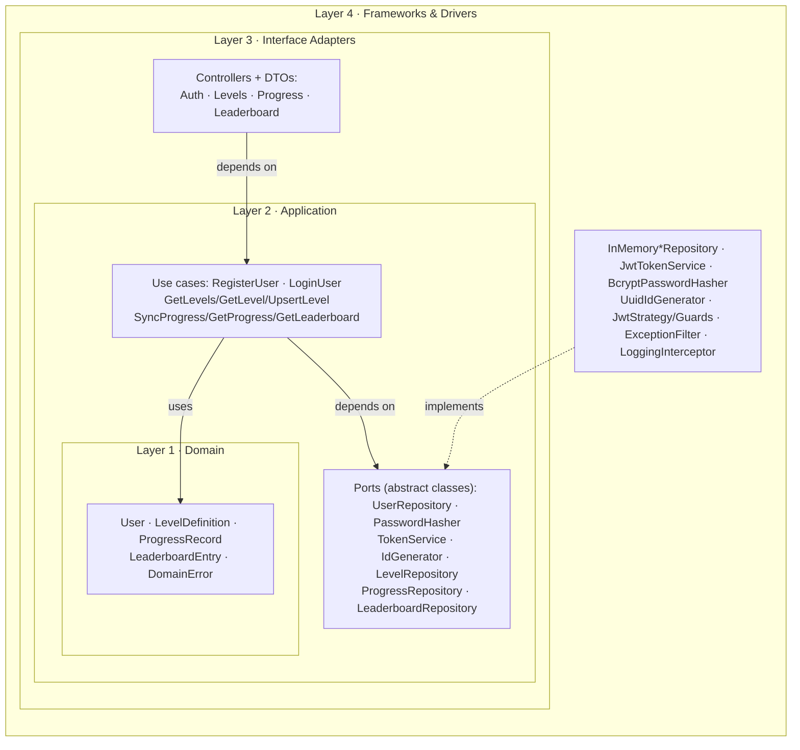
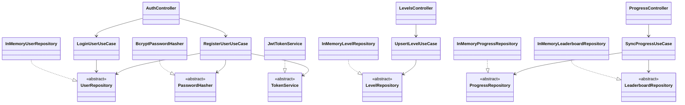

<!-- markdownlint-disable MD033 MD041 -->
<div align="center">

# 🛡️ Arrow Maze — Backend API

REST API for the **Arrow Maze** game: user authentication, progress sync, global leaderboard, and
remote level definitions. Built with **NestJS + TypeScript**, following **Clean Architecture**,
**SOLID**, **GoF patterns**, and **aspect-oriented cross-cutting concerns**.

[](https://github.com/danielsaco098/ArrowMaze-Backend/actions/workflows/ci.yml)
[](#-running-tests)
[](https://nestjs.com)
[](#-api-documentation)
[](./LICENSE)

</div>

---

## 📖 Description

This service is the server-side companion to the [Arrow Maze client](../ArrowMaze-Client). It manages
everything the game must not trust to the device alone:

- **User accounts** — registration and login secured with **JWT**.
- **Progress sync** — persist and retrieve completed levels and scores per user.
- **Global leaderboard** — best scores per level across all players.
- **Remote level definitions** — fetch/update levels so new content ships **without** a new app release.

> **Tech stack:** NestJS 11 · TypeScript (strict) · Passport-JWT · bcryptjs · `@nestjs/config` ·
> `@nestjs/swagger` (OpenAPI) · Jest + Supertest (e2e).
>
> _Persistence is **in-memory** by default (functional and dependency-free for demos and tests). It is a
> deferrable detail: the repository ports (`UserRepository`, `LevelRepository`, `ProgressRepository`,
> `LeaderboardRepository`) can be backed by a database (e.g. PostgreSQL) without touching the use cases._

---

## 🏛️ Architecture

Same **Clean Architecture** dependency rule as the client — everything points **inward**:

| Layer | Folder | Responsibility | Key components |
| --- | --- | --- | --- |
| **1 — Domain** | `src/domain` | Pure business rules, no framework imports. | Entities `User`, `LevelDefinition`, `ProgressRecord`, `LeaderboardEntry`; `DomainError` hierarchy (each carries its HTTP `status`) |
| **2 — Application** | `src/application` | Use cases + ports (ports are **abstract classes** doubling as DI tokens). | Use cases `RegisterUser`, `LoginUser`, `GetLevels`/`GetLevel`/`UpsertLevel`, `SyncProgress`, `GetProgress`, `GetLeaderboard`; ports `UserRepository`, `PasswordHasher`, `TokenService`, `IdGenerator`, `LevelRepository`, `ProgressRepository`, `LeaderboardRepository` |
| **3 — Interface Adapters** | `src/infrastructure/http` | REST controllers + DTOs (validation + Swagger). | `auth`, `levels`, `progress`/`leaderboard` controllers and DTOs |
| **4 — Frameworks & Drivers** | `src/infrastructure`, `src/modules`, `src/shared` | Volatile details. | In-memory repositories, `JwtTokenService`/`BcryptPasswordHasher`/`UuidIdGenerator`, Passport `JwtStrategy`, guards, Nest modules, Swagger setup, config |

The dependency rule means **use cases never import Nest or Express** — they depend on the abstract-class
ports in `src/application/ports`, which the Layer 4 providers implement and the modules bind via DI.

### Layer diagram (dependency rule)



### Class diagram (architecture-significant)



> Editable diagram sources (PlantUML) live in
> [`docs/diagrams/clean-architecture.puml`](./docs/diagrams/clean-architecture.puml) and
> [`docs/diagrams/class-diagram.puml`](./docs/diagrams/class-diagram.puml). The Mermaid blocks above render
> directly on GitHub; the PlantUML files can be exported to PNG with any PlantUML renderer.

---

## 🌐 API Endpoints

| Method | Path | Auth | Description |
| --- | --- | --- | --- |
| `POST` | `/auth/register` | — | Create a user account |
| `POST` | `/auth/login` | — | Authenticate, returns a JWT |
| `GET`  | `/levels` | — | List level definitions (client can sync new content) |
| `GET`  | `/levels/:id` | — | Get a single level definition |
| `PUT`  | `/levels/:id` | JWT (admin) | Create/update a level definition |
| `GET`  | `/progress` | JWT | Get the authenticated player's progress |
| `POST` | `/progress/sync` | JWT | Sync completed levels + scores |
| `GET`  | `/leaderboard/:levelId` | — | Top scores for a level |

> Errors use consistent HTTP semantics (`400/401/403/404/409/422/500`) with a uniform error body,
> produced by a centralized exception filter (see [AOP](#-aspect-oriented-programming-aop)).

---

## 📚 API Documentation

Interactive **Swagger / OpenAPI** docs are served at:

```
http://localhost:3000/api/docs
```

The raw OpenAPI JSON is available at `/api/docs-json`. All eight endpoints, request/response schemas and
the Bearer-auth scheme are documented there.

---

## 🧩 Design Patterns (GoF)

| Category | Pattern | Where / Why | Code |
| --- | --- | --- | --- |
| Creational | **Singleton** | NestJS providers are singletons by default, so the in-memory repositories hold one shared store per process and services exist once. | [in-memory-user-repository.ts](./src/infrastructure/persistence/in-memory-user-repository.ts) |
| Structural | **Adapter** | `JwtTokenService` adapts Nest's `JwtService` to the `TokenService` port; `BcryptPasswordHasher` adapts bcryptjs to `PasswordHasher`; the in-memory repos adapt a `Map` to the repository ports. | [jwt-token-service.ts](./src/infrastructure/security/jwt-token-service.ts) · [bcrypt-password-hasher.ts](./src/infrastructure/security/bcrypt-password-hasher.ts) |
| Behavioral | **Strategy** | Passport's `JwtStrategy` defines the token-validation algorithm; the `TokenService`/repository ports make their implementations interchangeable (e.g. swap JWT or a DB backend) without changing use cases. | [jwt.strategy.ts](./src/infrastructure/security/jwt.strategy.ts) · [token-service.ts](./src/application/ports/token-service.ts) |

---

## 🔠 SOLID Principles

- **S — Single Responsibility.** Controllers handle HTTP, use cases orchestrate
  ([`SyncProgressUseCase`](./src/application/use-cases/sync-progress.use-case.ts)), repositories handle
  persistence — never mixed.
- **O — Open/Closed.** New endpoints/use cases are added without modifying existing ones; a new repository
  backend implements the port instead of editing the use case.
- **L — Liskov Substitution.** Any [`UserRepository`](./src/application/ports/user-repository.ts)
  implementation (in-memory now, a DB-backed one later, or a fake in tests) is substitutable without
  breaking use cases.
- **I — Interface Segregation.** Narrow, focused ports
  ([`PasswordHasher`](./src/application/ports/password-hasher.ts),
  [`TokenService`](./src/application/ports/token-service.ts),
  [`IdGenerator`](./src/application/ports/id-generator.ts)) instead of one fat service interface.
- **D — Dependency Inversion.** Use cases depend on the abstract-class ports; the
  [modules](./src/modules/auth.module.ts) bind each port to a concrete provider via Nest's DI container.

---

## 🪡 Aspect-Oriented Programming (AOP)

Cross-cutting concerns are separated from the business logic **without an AOP library**, using NestJS's
native aspect primitives — interceptors, filters and guards — which wrap handlers transparently:

- **Centralized exception handling** —
  [`DomainExceptionFilter`](./src/shared/filters/domain-exception.filter.ts) catches any `DomainError`
  and maps it to a consistent HTTP response, so use cases just `throw` and never import anything HTTP.
- **Logging & tracing** — [`LoggingInterceptor`](./src/shared/interceptors/logging.interceptor.ts) records
  the method, path and duration of every request without a single log line in the controllers or use cases.
- **Security / authorization** — [`JwtAuthGuard`](./src/infrastructure/security/jwt-auth.guard.ts) and
  [`AdminGuard`](./src/infrastructure/security/admin.guard.ts) enforce an active session and the admin role
  before protected handlers run, keeping authorization out of the business logic.

The business code never references a logger, an HTTP status, or an auth check — those concerns live in the
filter, interceptor and guards and apply declaratively.

---

## 🚀 Getting Started

### Prerequisites

- **Node.js** ≥ 20 and **npm**
- A `.env` file (optional — see `.env.example`; sensible defaults are built in)

### Installation

```bash
git clone <backend-repo-url> ArrowMaze-Backend
cd ArrowMaze-Backend
npm install
cp .env.example .env   # optional: set JWT_SECRET and the seeded admin credentials
```

### Run locally

```bash
npm run build        # compile
npm run start:dev    # watch mode at http://localhost:3000
npm run start:prod   # run the compiled build
```

On startup a default **admin** account is seeded (`admin` / `admin12345` by default) so the admin-only
level endpoint is usable immediately. Sample levels are seeded too. Data is in-memory, so it resets on
restart.

---

## 🧪 Running Tests

```bash
npm test               # unit tests (Jest, AAA, should_..._when_...)
npm run test:e2e       # integration tests (Supertest against the real Nest app)
npm run test:cov       # coverage
```

- **Unit** — use cases in isolation against fakes/in-memory adapters of the ports.
- **Integration (e2e)** — the full application is bootstrapped and the HTTP endpoints are exercised with
  Supertest (register → login → JWT-protected calls, admin authorization, progress → leaderboard).
- CI runs build + unit + e2e on every push and Pull Request (`.github/workflows/ci.yml`).

---

## 🤖 AI Usage Documentation

See [`AI_USAGE.md`](./AI_USAGE.md) — tools, per-task prompt logs, modifications, and critical evaluation
(Section 7 of the brief).

---

## 🤝 Contributing

See [`CONTRIBUTING.md`](./CONTRIBUTING.md): **Conventional Commits** in English, protected `main`,
feature branches, and Pull Requests with passing CI.

---

## 📄 License

Released under the [MIT License](./LICENSE).
